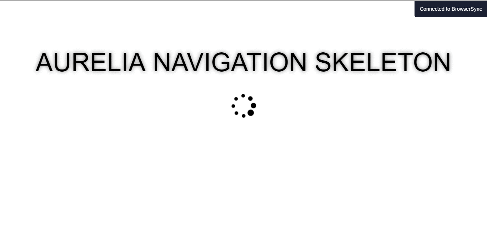

#### NPM package [aurelia-oauth](https://www.npmjs.com/package/aurelia-oauth)

## What is aurelia-oauth plugin?
aurelia-oauth is a plugin for [Aurelia](http://aurelia.io/) to provide support of user authorization using OAuth 2.0 Authorization Framework. 

aurelia-oauth has very similar functionality as [ADALjs library] (https://github.com/AzureAD/azure-activedirectory-library-for-js) and can be easily configured to integrate with OAuth2 APIs such as Azure Active Directory, Google etc.

aurelia-oauth plugin automatically uses 'Bearer' JWT (JSON WEB TOKEN) tokens to send requests to secured APIs by adding Authorization header. The underlying token is **never stored** on the client due to sensitive data security. Use this page - [JWT](https://jwt.io/) to decode tokens and investigate claims.   


This plugin implements only **OAuth implicit grant flow**, which is the recommended approach for both client side SPA applications and mobile apps. In this case, application does not need to supply login page and can leverage external login page with Single-Sign-On. Plugin relies on simple page redirects(**no popups!**) and therefore can be seamlessly used on mobile devices. Animation below shows plugin and its flow in action.



# Installation prerequisites
Obviously, you need to have installed [NodeJs](https://nodejs.org/) and [Gulp](http://gulpjs.com/). aurelia-oauth was based on [Aurelia plugin](https://github.com/aurelia/skeleton-plugin) and requires only standard Aurelia libraries. It's highly recommended to use JSPM for package managment.

# Installation
```
jspm install aurelia-oauth
```
Using Npm:
```
npm install aurelia-oauth --save
```
Using typescript you can install definitions:
```
typings install github:matik12/aurelia-oauth --save --global
```

# Usage guide

## Update the Aurelia configuration file

In your Aurelia configuration file(most commonly main.ts/js file), add the plugin and provide OAuth endpoint configuration :
```js
import 'aurelia-oauth';

export function configure(aurelia: Aurelia) {
  aurelia.use
    .standardConfiguration()
    .developmentLogging()
    .plugin('aurelia-oauth', configureOauth);

  aurelia.start().then(() => aurelia.setRoot());
}

function configureOauth(oauthService, oauthTokenService) {
  oauthService.configure(
    {
      loginUrl: 'https://accounts.google.com/o/oauth2/auth',
      logoutUrl: 'https://www.google.com/accounts/Logout?continue=https://appengine.google.com/_ah/logout',
      clientId: '215036514264-idvs69m8pitnqeec9oehc33sds59imhu.apps.googleusercontent.com',
      scope: 'https://www.googleapis.com/auth/userinfo.profile',
      alwaysRequireLogin: true,
      logoutRedirectParameterName: 'continue'
    });

  oauthTokenService.configure(
    {
      name: 'token id_token',
      urlTokenParameters: {
        idToken: 'id_token'
      }
    });
}
```
The above function for OAuth configuration provides sample configuration of Google API authorization endpoint.

## Browser support

This plugin should work with all modern browsers, although it is still in early phase and can contain few bugs. To support IE10 & IE11 you need to add the script tag to the head section of the main page(index.html) as shown below. It is related to the IE known-issue with # in URL and redirects. The following fix will not affect other correctly working browsers.
```js
<head>
	...
	<!-- Fix for IE bug with page reload when changing hash in url after redirect -->
	<script type="text/javascript">
		window.location.hash = window.location.hash;
	</script>
</head>
```