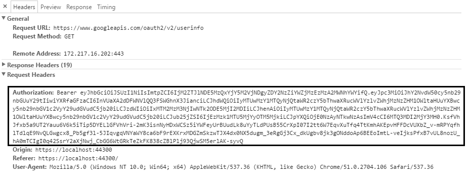

#### NPM package [aurelia-oauth](https://www.npmjs.com/package/aurelia-oauth)

## What is aurelia-oauth plugin?
aurelia-oauth is a plugin for [Aurelia](http://aurelia.io/) to provide support of user authorization using protocol OAuth 2.0. 

aurelia-oauth has very similar functionality as [ADALjs library] (https://github.com/AzureAD/azure-activedirectory-library-for-js) and is able integrate with OAuth2 APIs such as Azure Active Directory, Google etc.

aurelia-oauth plugin automatically uses 'Bearer' JWT (JSON WEB TOKEN) tokens to send requests to secured APIs by adding Authorization header. The underlying token is **never stored** on the client due to sensitive data security. Use this page [JWT](https://jwt.io/) to decode tokens and investiage claims.   



This plugin implements only OAuth implicit grant flow, which is the recommended approach for both client side SPA applications and mobile apps. Animation below shows plugin and its flow in action.


# Installation prerequisites
Obviously, you need to have installed [NodeJs](https://nodejs.org/) and [Gulp](http://gulpjs.com/). aurelia-oauth was based on [Aurelia plugin](https://github.com/aurelia/skeleton-plugin) requires only standard Aurelia libraries. It's highly recommended to use JSPM for package managment.

# Installation
```
jspm install aurelia-oauth
```
Using Npm:
```
Npm install aurelia-oauth --save
```